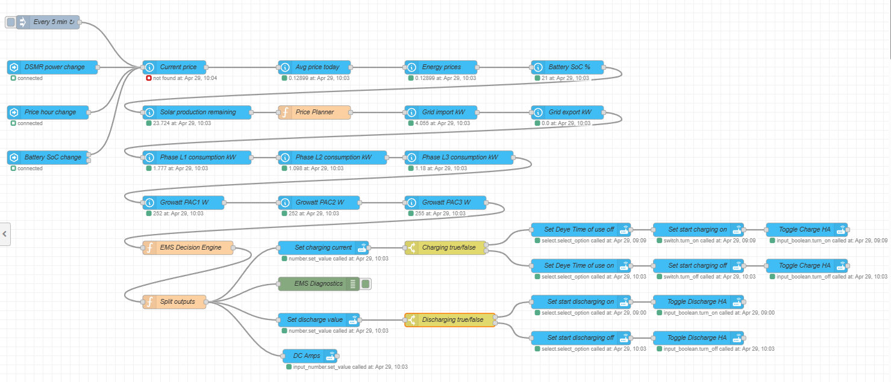

# Battery EMS – Node-RED Setup & Reference Guide
**EMS v3.18 / Planner v2.14 / EV v1.2** — Updated 3 May 2026



---

## My Setup

This flow was built around a **Growatt inverter** for the solar array and a **Deye inverter** for the battery bank. A **Zaptec Go EV charger** is also integrated — smart price-based EV charging runs as part of the same flow. The battery inverter connection is not included in this flow — how the DC amps, charging, and discharging booleans are wired to your inverter depends entirely on your hardware. The entity names used here reflect my installation; adjust them to match yours.

**Why Frank Energie for pricing?** Frank Energie provides open API access to the actual day-ahead market prices (APX/EPEX) used in the Netherlands. Even if you are on a different energy provider, these price curves accurately reflect the real market variation throughout the day — all Dutch dynamic tariff providers use the same underlying wholesale market, just with different markups on top. Using the raw market curve gives the best signal for when to charge and discharge.

**After importing the flow into Node-RED**, several nodes will show a red triangle — this is expected. Those nodes reference Home Assistant entities that need to be mapped to your specific installation. Go through each red node and update the entity ID to match what appears in your **Developer Tools → States**. The entity names documented in this guide are the ones used in my setup; yours may differ, especially for the DSMR meter, battery SoC sensor, and solar inverter.

---

## Prerequisites

Install in Node-RED via **Manage palette**:
- `node-red-contrib-home-assistant-websocket` — all Home Assistant nodes

---

## Home Assistant Integrations

All integrations must be installed and working before the EMS flow can function.

| Integration | Source | Purpose in EMS |
|---|---|---|
| **Frank Energie** | [github.com/HiDiHo01/home-assistant-frank_energie](https://github.com/HiDiHo01/home-assistant-frank_energie) | Hourly dynamic electricity prices — primary price source for planner and EMS |
| **DSMR Smart Meter** | [home-assistant.io/integrations/dsmr](https://www.home-assistant.io/integrations/dsmr/) | Real-time grid import/export (kW) and per-phase load (kW) via P1 port |
| **Growatt ESPHome** | [github.com/WaarlandIT/ESPHOME-Growatt](https://github.com/WaarlandIT/ESPHOME-Growatt) | Live solar AC output per phase (PAC1/2/3 in W) |
| **Forecast.Solar** | [home-assistant.io/integrations/forecast_solar](https://www.home-assistant.io/integrations/forecast_solar/) | Solar production forecast — used by planner to reduce grid charge hours, detect pre-discharge opportunities, and prevent solar overfill |
| **ha-solarman** | [github.com/davidrapan/ha-solarman](https://github.com/davidrapan/ha-solarman) | Battery state of charge (%) from BMS via Solarman protocol |
| **EnergyZero** | [home-assistant.io/integrations/energyzero](https://www.home-assistant.io/integrations/energyzero/) | Used only as an hourly trigger — not the price source |
| **Zaptec** | [github.com/custom-components/zaptec](https://github.com/custom-components/zaptec) | EV charger control — smart price-based charging, solar surplus absorption, battery protection |

> Frank Energie is the authoritative price source since Planner v2.4. EnergyZero is kept only as a trigger to fire the flow at the start of each new price hour.

---

## Step 1 – Home Assistant Helpers

Create these in **Settings → Devices & Services → Helpers** before importing the flow:

| Type | Entity ID | Min | Max | Step |
|---|---|---|---|---|
| `input_number` | `input_number.battery_dc_amps` | 0 | 200 | 1 |
| `input_boolean` | `input_boolean.battery_charging` | — | — | — |
| `input_boolean` | `input_boolean.battery_discharging` | — | — | — |

These are the three outputs the EMS writes every cycle. Your battery inverter integration reads from these.

---

## Step 2 – Sensor Entity Name Mapping

Verify these in the relevant `api-current-state` nodes after importing. Use **Developer Tools → States** to find your exact entity names.

### Frank Energie (price source) — [GitHub](https://github.com/HiDiHo01/home-assistant-frank_energie)
| Node | Entity ID | Output |
|---|---|---|
| Frank Energie prijzen | `sensor.frank_energie_prijzen_huidige_elektriciteitsprijs_all_in` | `msg.frankPrices` (attributes.prices array) |

> The planner calculates `currentPrice` and `avgPrice` directly from this array, overriding anything from EnergyZero sensors.

### DSMR Smart Meter — [HA Docs](https://www.home-assistant.io/integrations/dsmr/)
| Node | Entity ID | Output |
|---|---|---|
| Grid import kW | `sensor.dsmr_reading_electricity_currently_delivered` | `msg.gridImport` (kW) |
| Grid export kW | `sensor.dsmr_reading_electricity_currently_returned` | `msg.gridExport` (kW) |
| Phase L1 kW | `sensor.dsmr_reading_phase_currently_delivered_l1` | `msg.phaseL1` |
| Phase L2 kW | `sensor.dsmr_reading_phase_currently_delivered_l2` | `msg.phaseL2` |
| Phase L3 kW | `sensor.dsmr_reading_phase_currently_delivered_l3` | `msg.phaseL3` |

> Entity names vary by DSMR version. Search `dsmr` in Developer Tools → States to confirm yours.

### Growatt Solar (AC output per phase) — [GitHub](https://github.com/WaarlandIT/ESPHOME-Growatt)
| Node | Entity ID | Output |
|---|---|---|
| Solar PAC1 W | `sensor.growatt_pac1` | `msg.pac1` |
| Solar PAC2 W | `sensor.growatt_pac2` | `msg.pac2` |
| Solar PAC3 W | `sensor.growatt_pac3` | `msg.pac3` |

> AC watts per phase summed as `solarTotalW = pac1 + pac2 + pac3`.

### Forecast.Solar — [HA Docs](https://www.home-assistant.io/integrations/forecast_solar/)
| Node | Entity ID | Output |
|---|---|---|
| Solar forecast remaining | `sensor.energy_production_remaining_today` | `msg.solarForecastRemaining` (kWh) |

> The planner deducts this from `kwhNeeded` to reduce grid charge hours when solar will cover part of the charge. Also used to detect when solar will fill the battery before the cheap window opens. Falls back safely to 0 if unavailable.

### Battery SoC — [ha-solarman GitHub](https://github.com/davidrapan/ha-solarman)
| Node | Entity ID | Output |
|---|---|---|
| Battery SoC | `sensor.battery_state_of_charge` | `msg.batterySoC` (%) |

> Replace with your actual BMS/inverter SoC entity. For the StephanJoubert solarman integration use `sensor.deye_battery_soc`.

### Zaptec EV Charger — [GitHub](https://github.com/custom-components/zaptec)
| Node | Entity ID | Output / Action |
|---|---|---|
| Get Zaptec mode | `sensor.sloeierd_charger_mode` | `msg.zaptecMode` (str) |
| Set Zaptec current | `number.sloeierd_max_stroom` | Sets available charge current (0–6 A) |

> Replace `sloeierd` with your charger's entity prefix. Find it by searching `zaptec` in Developer Tools → States. The `Set Zaptec current` node uses `Action: number.set_value` with data `{"value": {{zaptecValue}}}`.

### Trigger nodes — [EnergyZero HA Docs](https://www.home-assistant.io/integrations/energyzero/)
| Node | Entity ID | Purpose |
|---|---|---|
| DSMR power change | `sensor.electricity_meter_energieverbruik` | Fire instantly on load change |
| Price hour change | `sensor.energyzero_today_energy_current_hour_price` | Fire on hourly price rollover |

---

## Step 3 – Node Chain Execution Order

**Battery SoC, Solar Forecast, and Zaptec mode must all be read before the EMS Decision Engine.**

```
[Every 5 min inject]  ──┐
[DSMR power change]   ──┼──► [Frank Energie prices] ──► [Battery SoC] ──► [Solar forecast] ──► [Set solarNow] ──► [Price Planner]
[Price hour change]   ──┘                                                                                               │
                                                                                                              [Grid import kW]
                                                                                                              [Grid export kW]
                                                                                                               [Phase L1 kW]
                                                                                                               [Phase L2 kW]
                                                                                                               [Phase L3 kW]
                                                                                                              [Solar PAC1 W]
                                                                                                              [Solar PAC2 W]
                                                                                                              [Solar PAC3 W]
                                                                                                           [Get Zaptec mode]
                                                                                                         [EMS Decision Engine]
                                                                                                          (outputs: 2)
                                                                              ┌──────────────────────────────────┘ └────────────────────┐
                                                                    [Split outputs]                                          [Set Zaptec current]
                                                        ┌───────────────┬───────────┐                                        [EV Diagnostics]
                                                [Set dc_amps] [Set charging] [Set discharging]
                                                                    [EMS Diagnostics]
```

**Important:** The EMS Decision Engine function node must be configured with **2 outputs** in Node-RED. Output 1 carries the battery message to `Split outputs`. Output 2 carries the EV message directly to `Set Zaptec current`.

### Set solarNow function node
Add a small function node between Solar PAC3 and Price Planner to pass current solar production to the planner for overfill detection:

```javascript
msg.solarNow = (parseFloat(msg.pac1) || 0)
             + (parseFloat(msg.pac2) || 0)
             + (parseFloat(msg.pac3) || 0);
return msg;
```

---

## Step 4 – Trigger Configuration

| Trigger | Interval | Purpose |
|---|---|---|
| Every 5 min inject | 300 s | Baseline heartbeat |
| DSMR power change | Every DSMR update (~2–10 s) | React instantly to home load changes |
| Price hour change | Every hour | React immediately when price rolls to next hour |

In both `server-state-changed` nodes, ensure:
- **Only send if state changes** — enabled
- **Ignore unavailable/unknown** — enabled on both incoming and outgoing state

---

## Step 5 – Battery Specs (verify in both scripts)

| Spec | Value | Config key |
|---|---|---|
| Capacity | 40 kWh | `BATTERY_KWH` |
| Voltage | 48 V DC | `BATTERY_VOLTAGE` |
| Max charge/discharge | 200 A | `MAX_AMPS` |
| Max charge power | ~8.16 kW (200 A × 48 V × 0.85) | derived |
| Max discharge power | 9.6 kW (200 A × 48 V / 1000) | `MAX_DISCHARGE_KW` |
| Round-trip efficiency | 85% | `ROUND_TRIP_EFF` |
| Usable discharge capacity | 32 kWh (SoC 95% → 15%) | derived |
| Full charge time (from SOC_MIN) | ~4.2 h at max rate | derived |
| Grid connection | 3-phase, 20 A fuse | `GRID_MAX_A_PHASE` = 18 (2 A margin) |

---

## Price Planner (v2.14) — How It Works

The planner runs first each cycle and calculates today's optimal charge and discharge schedule before any sensor data is read.

### Price source
Prices are read from the Frank Energie `attributes.prices` array. `currentPrice` and `avgPrice` are calculated from this array and written to `msg`, overriding anything from EnergyZero.

### kWh needed and solar deduction

```
usableCapacity = 40 × ((95% − 10%) / 100)  = 34 kWh
currentKwh     = 40 × ((SoC% − 10%) / 100)
kwhNeeded      = usableCapacity − currentKwh
solarUsable    = solarForecastRemaining × 0.90
```

Solar is split into before and after the cheap window using current production rate:
```
solarBeforeCheapWindow = solarNow_kW × hoursUntilCheapWindow
solarAfterCheapWindow  = max(0, solarUsable − solarBeforeCheapWindow)
kwhFromGrid    = max(0, kwhNeeded − solarAfterCheapWindow)
hoursNeeded    = ceil(kwhFromGrid / 8.16 kW) + 1 safety hour
```

Only solar arriving **after** the cheap window offsets grid charging — solar before the window fills the battery independently.

### Solar overfill pre-discharge (v2.14)

If current solar production rate × hours until cheap window exceeds available battery headroom, the planner flags pre-discharge hours to free capacity before the solar peak. This ensures the cheap grid window can actually be used rather than being skipped because the battery is already full from morning solar.

```
solarWillOverfill = solarBeforeCheapWindow >= currentHeadroom
kwhToFree        = max(kwhFromGrid, MIN_GRID_CHEAP_KWH=3.0 kWh)
targetSoC        = calculated to absorb kwhToFree before cheap window
```

### Charge window — centered on cheapest hour (v2.6 / v2.12)

The planner finds the single cheapest remaining hour and expands outward until `hoursNeeded` hours are filled, always preferring the cheaper neighbour. An **early-hour bias** (`EARLY_BIAS_EUR = 0.02`) keeps grid charging before the solar peak when neighbour prices are close.

The window is only built if `cheapestPrice <= avgPrice × 0.55`. If all remaining hours are expensive, `plannedChargeHours` is empty and the EMS falls back to ratio-based logic.

### Discharge window — centered on most expensive hour (v2.13)

```
kwhToDischarge       = 40 × ((95 − 15) / 100) = 32 kWh
dischargeHoursNeeded = ceil(32 / 9.6 kW) + 1  = 5h
```

The most expensive remaining hour above `avgPrice` becomes the center. The window expands outward with a **late-hour bias** (`LATE_BIAS_EUR = 0.02`) to keep it anchored in the evening peak. Hours overlapping the charge window are removed.

### Pre-discharge before negative price windows (v2.11)

When negative price hours are forecast later today, the planner flags hours before the negative window as pre-discharge candidates — so the battery is empty and ready to charge for free.

### Planner config constants

| Constant | Value | Description |
|---|---|---|
| `BATTERY_KWH` | 40 | Battery capacity |
| `SOC_MIN` | 10% | Minimum SoC floor |
| `SOC_MAX` | 95% | Maximum SoC ceiling |
| `SOC_NORMAL_THRESHOLD` | 80% | Above this uses tight charge cap |
| `CHARGE_ABS_RATIO` | 0.55 | Tight charge cap = `avgPrice × 0.55` |
| `DISCHARGE_ABS_RATIO` | 0.55 | Discharge abs min = `avgPrice × 0.55` |
| `SOLAR_FORECAST_EFF` | 0.90 | 10% margin on solar forecast |
| `SAFETY_BUFFER_H` | 1 | Extra hour added to `hoursNeeded` |
| `ROUND_TRIP_EFF` | 0.85 | Max charge kW rate calculation |
| `EARLY_BIAS_EUR` | 0.02 | Prefer earlier hours in charge window expansion |
| `LATE_BIAS_EUR` | 0.02 | Prefer later hours in discharge window expansion |
| `MAX_DISCHARGE_KW` | 9.6 | Max discharge rate for window sizing |
| `SOC_DISCHARGE_MAX` | 95% | SoC from which discharge is measured |
| `SOC_DISCHARGE_MIN_PL` | 15% | SoC floor used in discharge window sizing |
| `SOLAR_OVERFILL_RATIO` | 1.0 | Solar/headroom ratio threshold for overfill detection |
| `MIN_GRID_CHEAP_KWH` | 3.0 | Minimum kWh to always absorb at cheapest price |

---

## EMS Decision Engine (v3.18) — Configuration Reference

### CFG parameters

| Parameter | Value | Description |
|---|---|---|
| `MAX_AMPS` | 200 | Hard cap on DC output amps |
| `BATTERY_VOLTAGE` | 48 | Nominal DC bus voltage (V) |
| `BATTERY_KWH` | 40 | Usable capacity (kWh) |
| `SOC_MIN` | 10% | Discharge floor |
| `SOC_MAX` | 95% | Hard charge ceiling — no exceptions |
| `SOC_DISCHARGE_MIN` | 15% | Discharge guard — never discharges below this |
| `SOC_CRITICAL` | 20% | At or below this, charge at full amps if price is genuinely cheap |
| `CHARGE_THRESHOLD` | 0.80 | Ratio for price override and fallback charging |
| `DISCHARGE_THRESHOLD` | 1.20 | Fallback discharge if price ≥ 120% of avg (no planner) |
| `CHARGE_ABS_RATIO` | 0.55 | `chargeAbsMax` = `avgPrice × 0.55` |
| `DISCHARGE_ABS_RATIO` | 0.55 | `dischargeAbsMin` = `avgPrice × 0.55` |
| `DISCHARGE_OVERSHOOT` | 1.25 | 25% overshoot on discharge target for inverter lag |
| `EXPORT_BIAS_W` | 800 | Watts added to discharge target to push toward export |
| `HYSTERESIS` | 0.05 | Price ratio band to prevent rapid toggling |
| `SOLAR_SURPLUS_W` | 500 | Min solar export surplus (W) to start solar charging |
| `SOLAR_SURPLUS_EXIT_W` | 200 | Min solar export surplus (W) to keep solar charging |
| `SOLAR_SUPPRESS_DISCHARGE_W` | 500 | Suppress min-discharge when solar surplus exceeds this |
| `ROUND_TRIP_EFF` | 0.85 | Charging efficiency — charge amps only, NOT discharge |
| `GRID_MAX_A_PHASE` | 18 | Usable amps per phase (20 A fuse − 2 A margin) |
| `GRID_VOLTAGE` | 230 | AC grid voltage |
| `SAFETY_MARGIN_A` | 2 | Per-phase headroom buffer |
| `MIN_DISCHARGE_A` | 35 | Minimum meaningful discharge current (A) |
| `MIN_CHARGE_A` | 10 | Minimum charge current — floor for negative price spread |
| `EV_MAX_AMPS` | 6 | Maximum EV charge current (A) |
| `EV_SOLAR_MIN_W` | 1400 | Min solar surplus to start EV charging (6A × 230V) |
| `EV_SOLAR_EXIT_W` | 800 | Min solar surplus to keep EV charging |
| `EV_RATE_LIMIT_MS` | 900000 | 15 min between Zaptec writes (API recommendation) |

### Decision priority — Battery (highest to lowest)

```
1. Negative price AND canCharge          → spread charge across negative window;
                                           solar offsets grid draw to keep netGrid ~0

2. isPriceLow AND canCharge              → charge at scaled amps
     a) SoC <= SOC_CRITICAL AND cheap    → full amps, critical recovery
     b) inChargingWindow = true          → solar-adjusted scaled amps
     c) isPriceVeryLow (ratio ≤ 0.80     → scaled amps, outside planned window
        AND price ≤ avgPrice × 0.55)

3. Solar surplus AND NOT inDischargeWindow → absorb surplus (skipped during discharge window)

4. inSolarPreDischargeWindow             → pre-discharge before solar overfills battery
                                           (creates room for cheap grid charging)

5. inPreDischargeWindow                  → pre-discharge before negative price window

6. isPriceHigh AND canDischarge
     a) dischargeTarget > 0             → cover gross import + export bias
     b) dischargeTarget = 0 AND         → export at MIN_DISCHARGE_A
        surplus < SOLAR_SUPPRESS_W        (suppressed if solar already exporting)

7. Idle
```

### EV load subtraction (v3.18)

When the EV is charging from grid, the DSMR meter reports that as home import. Without correction the battery would discharge to compensate for the intentional EV load. The EMS subtracts EV charging power from both `netGridW` and `dischargeTargetW` each cycle:

```javascript
evChargingW      = lastEvAmps × GRID_VOLTAGE        // e.g. 6A × 230V = 1380W
netGridW         = max(0, (gridImport − gridExport) × 1000 − evChargingW)
dischargeTargetW = max(0, gridImport × 1000 − evChargingW)
```

`lastEvAmps` is stored in context by the EV controller each cycle and read back by the EMS on the next cycle.

### Solar-aware charge rate (v3.17)

During the planned charge window, when solar will cover part of `kwhNeeded`, the grid charge rate is reduced proportionally to avoid unnecessary grid import while solar does the heavy lifting:

```javascript
solarCoverageRatio = min(1.0, solarAfterCheapWindow / kwhNeededForGrid)
solarAdjFraction   = max(MIN_SOLAR_GRID_FRACTION=0.20, fraction × (1 − solarCoverageRatio))
targetAmps         = maxAllowedChargeA × solarAdjFraction
```

### Charge reason strings

| Trigger | Reason string |
|---|---|
| Critical SoC | `Critical SoC (19%) - charging at max 155 A` |
| Planner window, solar adjusted | `Planner: cheapest window (0.060 EUR) - charging at 29 A (solar covers 90% of grid need, reduced from 146 A). Hours: 12h,13h,14h` |
| Planner window, no solar | `Planner: cheapest window (0.127 EUR) - charging at 94 A. Hours: 12h,13h,14h` |
| Price override | `Price override: 41% of avg (0.078 EUR) below threshold - charging at 155 A outside planned window` |
| Negative price with solar | `Negative price (-0.084 EUR/kWh) - charging at 123 A (6 neg-price hour(s) remaining, spreading 30.0 kWh over window, solar covers ~42 A, grid ~81 A)` |
| Negative price no solar | `Negative price (-0.185 EUR/kWh) - charging at 10 A (4 neg-price hour(s) remaining, spreading 1.2 kWh over window)` |
| Solar pre-discharge | `Solar pre-discharge: solar will fill battery before cheap window - discharging 72 A (target SoC 72%, freeing 3.0 kWh for cheap grid charging)` |
| Neg-price pre-discharge | `Pre-discharge: neg price in 3h (4 neg hour(s)) - discharging 194 A to free 28.0 kWh over 3h (SoC 85% → 15%)` |

---

## EV Charge Controller (v1.2) — How It Works

The EV controller runs at the end of the EMS Decision Engine function node. It shares all EMS calculated values and outputs a second message for the Zaptec charger. The EMS function node must be set to **2 outputs**.

### EV charging rules

| Priority | Condition | EV amps | Reason |
|---|---|---|---|
| 1 | Car not connected | 0 | Off — `zaptecMode = disconnected` |
| 2 | Battery discharging | 0 | Paused — never charge EV from battery |
| 3 | In cheap price window | 6 A | Price ≤ avg × 0.55 and in planner window |
| 4 | Price override | 6 A | Price ≤ 80% of avg AND ≤ avg × 0.55 |
| 5 | Solar surplus ≥ 1400 W | 6 A | Absorb export into EV instead of grid |
| 6 | Cheapest hour of day | 6 A | Always charge at best available price (even above cap) |
| 7 | None of above | 0 | Paused |

**Key rules:**
- The EV **never charges from the battery** — when `discharging = true`, EV is always paused
- Solar surplus charging absorbs export that would otherwise go to grid at low/negative price
- The cheapest hour fallback ensures the EV always charges at the best available price, even on expensive days when no hour falls below the battery's price cap
- Zaptec writes are rate-limited to once per 15 minutes per Zaptec API recommendation

### EV rate limiting

The EV controller uses context to track the last write time. It only writes to Zaptec when the amps value changes OR 15 minutes have elapsed. When rate-limited, the second output returns `null` — Node-RED automatically suppresses null messages so Zaptec receives no spurious command.

### EV diagnostic output (output 2)

```javascript
{
  payload: {
    version:      "EV v1.2",
    targetAmps:   6.0,
    carConnected: true,
    reason:       "Cheapest hour fallback (0.177 EUR) - EV charging at 6 A (best available)",
    inputs: {
      zaptecMode:     "connected_requesting",
      currentPrice:   0.177,
      avgPrice:       0.238,
      surplus_W:      0,
      discharging:    false,
      lastEvAmps:     0,
      cheapestHour:   14,
      cheapestPrice:  0.177,
      evCheapestHour: 14,
      currentHour:    14,
      timeSince_s:    904
    }
  },
  zaptecValue:   6.0,    // use {{zaptecValue}} in Set Zaptec current node
  evTargetAmps:  6,
  evShouldWrite: true
}
```

---

## Diagnostic Output Structure — Battery (output 1)

```javascript
msg.payload = {
  version:     "EMS v3.18 / Planner v2.14",
  dc_amps:     117,
  charging:    false,
  discharging: true,
  reason:      "High price (128% of avg, 0.261 EUR) - discharging 117 A to cover 4178 W gross import + 800 W export bias",

  planner: {
    inWindow:               false,
    inDischargeWindow:      true,
    inPreDischargeWindow:   false,
    inSolarPreDischargeWindow: false,
    preDischargeHours:      [],
    solarPreDischargeHours: [],
    solarPreDischargeTargetSoC: 15,
    hoursUntilNegWindow:    null,
    futureNegHoursCount:    0,
    negPriceHoursRemaining: 0,
    dischargeThreshold:     0.244,
    hoursNeeded:            3,
    kwhNeeded:              29.6,
    kwhFromGrid:            8.2,
    solarForecastKwh:       21.4,
    solarAfterCheapWindow:  14.1,
    kwhNeededForGrid:       8.2,
    cheapestPrice:          0.060,
    cheapestHour:           13,
    plannedHours:           [12, 13, 14],
    plannedDischargeHours:  [19, 20, 21, 22, 23],
    reason:                 "Need 29.6 kWh total, solar covers ~21.4 kWh, 8.2 kWh from grid (3h)..."
  },

  inputs: {
    currentPrice:        0.261,
    avgPrice:            0.205,
    priceRatio:          127.6,
    chargeAbsMax:        0.113,
    dischargeAbsMin:     0.113,
    lastState:           "discharging",
    batterySoC:          22,
    solarTotal_W:        1530,
    netGrid_W:           4178,       // EV load already subtracted
    dischargeTarget_W:   4178,       // EV load already subtracted
    actualSurplus_W:     0,
    evCharging_W:        0,          // W currently consumed by EV
    evLastAmps:          0,          // A commanded to Zaptec last cycle
    phaseL1_A:           4.05,
    phaseL2_A:           3.84,
    phaseL3_A:           10.28,
    maxPhaseLoad_A:      10.28,
    worstHeadroom_A:     5.72,
    gridHeadroom_W:      3948,
    maxAllowedCharge_A:  70,
    timestamp:           "2026-05-03T12:40:52.533Z"
  }
}
```

---

## Troubleshooting

| Symptom | Likely cause | Fix |
|---|---|---|
| Always idle, dc_amps 0 | Wrong entity names | Use Developer Tools → States to verify all entity IDs |
| `priceRatio` always 100% | `avgPrice` = 0 | Check Frank Energie entity has `attributes.prices` populated |
| `inChargingWindow: null` | Frank Energie array empty | Check planner node status — yellow dot = no price data |
| SoC not updating | Wrong SoC entity | Replace `sensor.battery_state_of_charge` with your BMS entity |
| Discharge amps ~18% too high | Old pre-v3.5 script | Check version string in debug output |
| Discharging below avg price | Old pre-v3.6 script | `isPriceHigh` avgPrice guard missing — update to v3.6+ |
| Not charging at cheap hours outside window | Old pre-v3.7 script | `isPriceVeryLow` override missing — update to v3.7+ |
| Charging at expensive hours at low SoC | Old pre-v3.8 script | `SOC_CRITICAL` lacks `chargeAbsMax` guard — update to v3.8+ |
| Battery charges above 95% | Old pre-v3.9 script | `canCharge` had `isNegPrice` override — update to v3.9+ |
| Discharge not stopping at low SoC | Old `canDischarge` bug | Ensure EMS v3.5+ is deployed |
| Solar forecast not deducting | `solarForecastRemaining` = 0 | Check `get-solar-forecast` node; verify `sensor.energy_production_remaining_today` |
| `[confirming 1/2]` in reason | State pending confirmation | Normal — resolves next cycle |
| `maxAllowedCharge_A: 0` | Home load near grid limit | Large appliance consuming headroom — EMS resumes when load drops |
| Charging at max during negative price | Old pre-v3.10 script | Update to EMS v3.10+ for spread charging |
| Battery fills before cheap window (solar) | Solar overfill not detected | Check `Set solarNow` node is in chain before Price Planner; update to Planner v2.14+ |
| Charging planned at expensive evening hours | Old pre-v2.12 planner | Charge window validity gate missing — update to Planner v2.12+ |
| Negative amps / wrong Deye value | Old pre-v3.13 EMS | `fraction` not clamped — update to EMS v3.13+ |
| Battery discharging to cover EV load | Old pre-v3.18 EMS | EV load subtraction missing — update to EMS v3.18+ |
| EV always 0A despite cheap price | EMS node set to 1 output | Change EMS function node outputs to 2; wire output 2 to Set Zaptec current |
| Set Zaptec current: Invalid JSON | Wrong data field template | Use `{"value": {{zaptecValue}}}` and uncheck Block input overrides |
| EV charges at wrong time | `cheapestHour` not passed | Ensure Planner v2.14+ deployed; `msg.cheapestHour` must be set |
| EV charges while battery discharges | Old pre-v3.18 EMS | EV discharging guard missing — update to EMS v3.18+ |
| `timeSince_s` very large on first run | Context default 0 | Normal on first deploy — resets after first write cycle |
| Solar surplus charging during discharge window | Old pre-v3.15 script | Update to EMS v3.15+ |
| Discharge window wrong size or hours | Old pre-v2.13 planner | Update to Planner v2.13+ for centered expansion |

---

## Version History

| Version | Date | Change |
|---|---|---|
| **EMS v3.18** | 2026-05-03 | EV Charge Controller v1.2 integrated as second output; EV load subtracted from `netGridW` and `dischargeTargetW` so battery never compensates for EV grid draw |
| **EMS v3.17** | 2026-05-02 | Solar-aware charge rate: grid charge amps reduced proportionally when solar forecast covers part of `kwhNeeded`; floor at 20% of max |
| **EMS v3.16** | 2026-05-01 | Solar overfill pre-discharge branch added — discharges to `solarPreDischargeTargetSoC` when solar will fill battery before cheap window |
| **EMS v3.15** | 2026-04-28 | Solar surplus charging suppressed during `inDischargeWindow` — discharge takes priority in evening peak |
| **EMS v3.14** | 2026-04-28 | Min-discharge suppressed when solar surplus > `SOLAR_SUPPRESS_DISCHARGE_W` (500 W) |
| **EMS v3.13** | 2026-04-26 | `fraction` clamped to [0.10, 1.0] — prevents negative dc_amps; charge window validity gate |
| **EMS v3.12** | 2026-04-26 | Pre-discharge before negative price windows |
| **EMS v3.11** | 2026-04-26 | Solar surplus offsets grid draw during negative price charging |
| **EMS v3.10** | 2026-04-26 | Negative price charging spread across full negative window |
| **EMS v3.9** | 2026-04-26 | Hard `canCharge` ceiling — no negative price override |
| **EMS v3.8** | 2026-04-26 | `SOC_CRITICAL` requires `currentPrice <= chargeAbsMax` |
| **EMS v3.7** | 2026-04-25 | `isPriceVeryLow` ratio override; distinct reason strings |
| **EMS v3.6** | 2026-04-25 | `SOC_CRITICAL` boundary fix; `isPriceHigh` avgPrice guard |
| EMS v3.5 | 2026-04-20 | `canDischarge` bug fixed; `ROUND_TRIP_EFF` removed from discharge |
| EMS v3.4 | 2026-04-19 | Fixed thresholds replaced with `avgPrice` ratios |
| EMS v3.3 | 2026-04-15 | Solar surplus `canChargeSolar`; moved before discharge branch |
| EMS v3.2 | 2026-04-12 | `SOC_DISCHARGE_MIN` 15%; gross import as discharge base |
| EMS v3.1 | 2026-04-10 | `SOC_DISCHARGE_MIN` 15%; `SOC_CRITICAL` 20% |
| EMS v3.0 | 2026-04-08 | P1 phase readings for per-phase headroom |
| **EV v1.2** | 2026-05-03 | `cheapestHour` parsed with `parseInt` to handle string/null; `evCheapestHour` debug field added |
| **EV v1.1** | 2026-05-03 | Integrated into EMS v3.18 as second output; `currentHour` defined; `zaptecValue` float for Zaptec node; full diagnostic payload |
| **EV v1.0** | 2026-05-03 | Initial standalone EV Charge Controller |
| **Planner v2.14** | 2026-05-02 | Solar deduction split into before/after cheap window; solar overfill pre-discharge using real-time production rate; `MIN_GRID_CHEAP_KWH = 3.0` always reserves room for cheapest-hour grid charging; `cheapestHour` added to outputs |
| **Planner v2.13** | 2026-04-28 | Discharge window centered on most expensive hour, sized from usable capacity; `LATE_BIAS_EUR` |
| **Planner v2.12** | 2026-04-26 | Charge window validity gate |
| **Planner v2.11** | 2026-04-26 | Pre-discharge detection before negative windows |
| **Planner v2.10** | 2026-04-26 | `negPriceHoursRemaining` for spread charging |
| **Planner v2.9** | 2026-04-26 | Early-hour bias in charge window expansion |
| **Planner v2.8** | 2026-04-25 | Solar forecast deduction; `kwhFromGrid` and `solarForecastKwh` |
| **Planner v2.7** | 2026-04-25 | Discharge band filter raised to `avgPrice` |
| **Planner v2.6** | 2026-04-25 | Charge window centered on cheapest hour |
| Planner v2.5 | 2026-04-20 | Price ratios aligned with EMS v3.5 |
| Planner v2.4 | 2026-04-19 | Frank Energie as price source |
| Planner v2.3 | 2026-04-17 | Single `PLANNER_VERSION` variable |
| Planner v2.2 | 2026-04-15 | `SOC_NORMAL_THRESHOLD` raised to 80% |
| Planner v2.1 | 2026-04-14 | Fixed `msg.plannerVersion` / `inWindow` bugs |
| Planner v2.0 | 2026-04-13 | `dischargeThreshold` after conflict filter |
